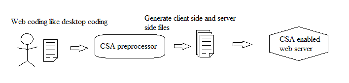
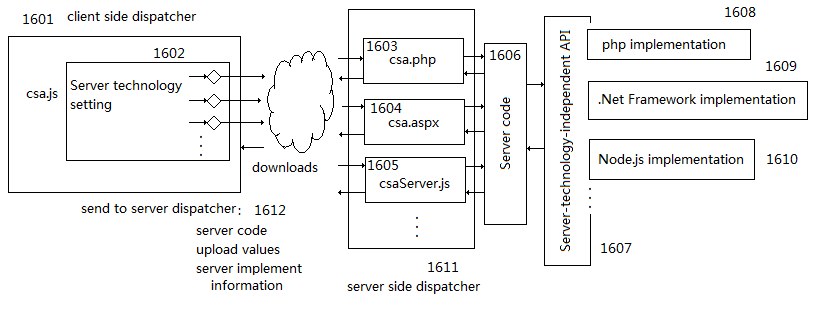

# Client-Server-Automation
## What is Client Server Automation?

Client Server Automation (CSA) makes web application development the same as desktop application development. This repository includes CSA for JavaScript, including source code and documentation for CSA, including a preprocessor, run time files, and sample code. It also includes test utility and test cases, and debugging utility.
This project adds CSA to JavaScript and thus creates a new programming paradigm with following distinctive features.
1.	It completely removes client/server related programming tasks from JavaScript programming. All server side functionalities are used in programming as if they were client side functionalities. Web programming is done in a same way as doing local programming.
2.	It provides a freedom of choosing runtime server side handling technology without affecting web programming. For example, the user may switch between PHP, ASP.NET, Node.js, etc., without affecting web programming.
For example, the following JavaScript code uses values and files entered via a web page to send an email, display results on the web page and record the process in a database. You can see that there is not a distinguishing of client operations and server operations.
```javascript
var barHolder = document.getElementById('divBarHolder');
	var bar = document.getElementById('bar');
	document.getElementById('file1').files.onreadystatechange = function (request) {
		if (request.readyState == 4 && request.status == 200) {
			//show full progress bar
			bar.style.width = barHolder.style.width;
			document.getElementById('lblstt').innerHTML = 'file(s) uploaded. ';
		}
	};
	document.getElementById('file1').files.onprogress = function (e) {
		//show file upload progress
		bar.style.width = (barHolder.offsetWidth * (e.loaded / e.total)) + 'px';
	}
	var subject = document.getElementById('inputSubject').value;
	var mailbody = document.getElementById('textareaBody').value;
	var recipients = document.getElementById('inputRecipients').value;
	document.getElementById('file1').files.Upload('uploads/');//upload files to be attached to the email
	//create a server object which is defined in database.js
	var Db1 = new Database('database1');
	//execute a few server functions
	Db1.setCommand('Insert into EmailRecord (Subject, Body, Recipients, RequestTime, AttachFiles) Values (@Subject, @Body, @Recipients, @RequestTime, @AttachFiles)');
	Db1.addParameter('@Subject', 0, 200, subject);
	Db1.addParameter('@Body', 16, 2000, mailbody);
	Db1.addParameter('@Recipients', 16, 2000, recipients);
	Db1.addParameter('@RequestTime', 6, 8, Date());
	var filepaths = '';
	if (document.getElementById('file1').files.length > 0) {
		filepaths = document.getElementById('file1').files[0].filepath;
		for (var i = 1; i < document.getElementById('file1').files.length; i++) {
			filepaths += ';';
			filepaths += document.getElementById('file1').files[i].filepath;
		}
	}
	Db1.addParameter('@AttachFiles', 16, filepaths.length, filepaths);
	var dberr = Db1.execute();
	//code branching using a server expression and involving client and server execution paths
	if (dberr.length == 0) {
		//create a server object which is defined in mailtool.js
		var Email1 = new SendMail('webMail1');
		//execute a server function
		Email1.send(subject, mailbody, recipients, "myname@myhost.com", document.getElementById('file1').files);
		//create a server object which is defined in database.js
		var Db2 = new Database('database1');
		//execute a few server functions
		Db2.setCommand('update EmailRecord set ErrorMessage=@message where EmailRecID=@mailId');
		Db2.addParameter('@message', 16, 2000, Email1.ErrorMessage());
		Db2.addParameter('@mailId', 11, 8, Db1.LastAutoNumber());
		dberr = Db2.execute();
		if (dberr.length > 0) {
			dberr = 'Database error:' + dberr;
		}
		if (Email1.ErrorMessage().length > 0) {
			dberr = 'Mail error:' + Email1.ErrorMessage() + '. ' + dberr;
		}
		//excute a client operation
		document.getElementById('labelMessage').innerHTML = dberr;
		//code branching using a server function call
		if (Db1.LastAutoNumber() > 0) {
			//create a server object which is defined in database.js
			var Db3 = new Database('database1');
			//execute a few server functions
			Db3.setCommand('update EmailRecord set FinishTime=@time where EmailRecID=@mailId');
			Db3.addParameter('@time', 6, 8, Date());
			Db3.addParameter('@mailId', 11, 8, Db1.LastAutoNumber());
			var dberr2 = Db3.execute();
			//code branching on a server expression, involving client execution path
			if (dberr2.length > 0) {
				//a client operation involving server value
								document.getElementById('labelMessage').innerHTML = ' Database error setting finish time:' + dberr2;
			}
		}
	}
	else {
		//a client operation involving server value
		document.getElementById('labelMessage').innerHTML = 'Database error:' + dberr;
	}  

```
The above JavaScript code uses server side objects and functionalities in the same way as client side objects and functionalities are used. They are also included in a web page in the same way as client side libraries are included, as shown below:
```html
		<script src = "serverjs/database.js"></script>
		<script src ="serverjs/mailtool.js"></script>
		<script src = "clientjs/FileAPIclient.js"></script>
```
## How Client Server Automation Works?
This project implements CSA via two parts of work: 1. a CSA preprocessor to refactor web programming made by human developers; 2. runtime support files to handle client server related functionalities weaved into web programming by the CSA preprocessor.

## CSA Preprocessor
Core functionality of the CSA preprocessor is implemented in a JavaScript file, csapreproc.js. A web page, csapreproc.html, is used to host csapreproc.js. A web server environment is needed to launch csapreproc.html. A command line utility program is created to launch csapreproc.html to process human coding. You use command line parameters to specify human coding to be processed.
## CSA Enabled web server
The following figure shows a CSA enabled web server.

To enable CSA for a web server, following files should be copied to the web server.
1.	csa.js – this is a client side dispatcher. It handles client/server communications via AJAX. It will be added to a web page by a CSA preprocessor.
2.	Server side dispatchers – for each server technology to be supported, a corresponding server side dispatcher is needed. It talks with csa.js to accomplish client/server communications. Three server side dispatchers are provided:
  *	csa.php – it is a server side dispatcher to support PHP
  *	csaServer.js – it is a server side dispatcher to support Node.js
  *	csa.aspx and related DLL files – it is a server side dispatcher to support ASPX
3.	Server side API files – it is a set of JavaScript files representing supported server side functionality. The API is referred to as “Server Technology Independent API” in the figure. For example, “database.js” and “mailtools.js” are such library files. These files are to be used by human developers in the same way as client side JavaScript libraries are used. All other runtime files shown in the figure are not used by human developers.
4.	Server side API implementations – For each supported server technology there is a set of files which implement the server side API. In each JavaScript file of “Server-technology-independent API”, there can be undefined objects to be implemented by supported server technologies.
## Project status
This project has not reached a state for production usages. 1. The CSA preprocessor does not handle all programming situations; 2. There is not a mature server side API being proposed and implemented. 
1.	CSA Preprocessor – Current version of the CSA preprocessor has formed a solid foundation for further development; it detects client server operations, analyses upload and download values, maintaining server states at client side, handles following control flows: “if”, “for”, ”for…in”, “client function containing server operations”, generates asynchronous server connections, generates client side JavaScript files and server side JavaScript files. There are 21 test HTML files. Much more test files and test cases are to be created and tested by the preprocessor. 
2.	Server side JavaScript libraries to represent “Server Technology Independent API”– Some sample library files have been created, such as for SQL execution, email sending, file upload, etc. There should be a set of carefully designed “Server Technology Independent API” to cover most commonly used server side functionalities. A committee or a voting/RFC process may be needed for making specifications for the “Server Technology Independent API”.
## Development of the CSA Preprocessor
The core functionality of the CSA Preprocessor is coded in a JavaScript file csapreproc.js. This file is developed incrementally by a “test-driven” approach and a “debug-driven” approach.
1.	“Test-driven” approach: a new test case HTML file is created to include JavaScript code to be processed by the CSA Preprocessor; csapreproc.js is modified to make it to produce desired JavaScript files. During the process of modifying csapreproc.js, run a test utility to make sure that all existing test cases are not damaged by modifications of csapreproc.js. Once the modifications of csapreproc.js pass all the tests, the new test case HTML file and the desired JavaScript files become part of test cases so that future modifications of csapreproc.js should not damage the work.
2.	“Debug-driven” approach: to enhance csapreproc.js is to run it against a new JavaScript programming code and step into it and identify the places where code in csapreproc.js does not do processing as desired. It is a process similar to JavaScript debugging in a web Browser. 

For details of the above approaches, see [CSA_Preprocessor_Development.PDF](CSA_Preprocessor_Development.PDF).
